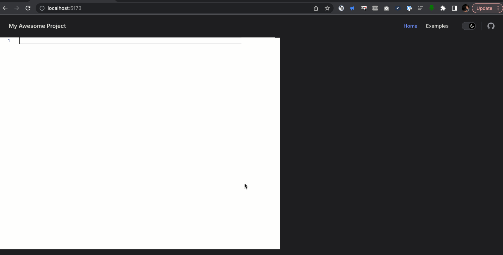
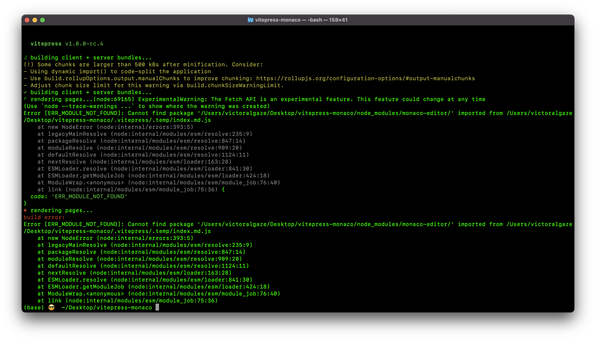

Now working per guidance: https://github.com/vuejs/vitepress/issues/2832#issuecomment-1689498631

---

## Setup

```
npm i
npm run docs:dev #works
npm run docs:build #failure
```

## Screenshots

### Dev working



### Build failing



## Other Resources/Issues:

- https://github.com/vuejs/vitepress/issues/1508
- https://github.com/vitejs/vite/discussions/1791#discussioncomment-321046
- https://twitter.com/youyuxi/status/1355316139144970240?s=20
